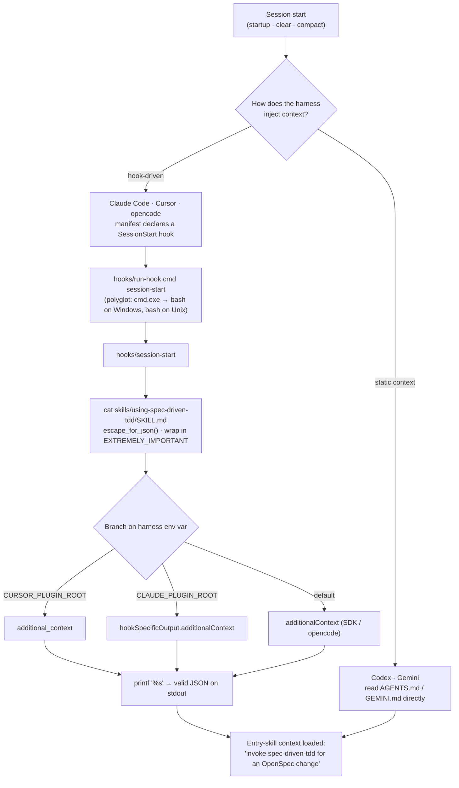
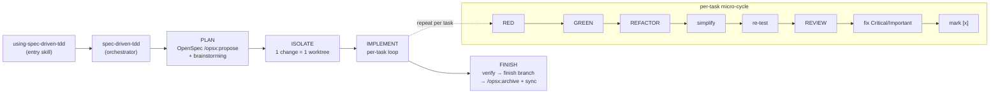

# spec-driven-tdd

An installable, multi-harness skill-pack that fuses **OpenSpec** (planning +
task tracking) with **Superpowers** (TDD, simplify, code review) into one
delivery loop.

Plan in OpenSpec → isolate in a worktree → implement each task via
TDD → simplify → review → finish and archive. A task is done only after a clean
review, not at green tests.

- Composes existing skills by name (depend, not vendor). The only vendored skill
  is the portable `simplify`.
- Works across Claude Code, Codex, Cursor, Gemini, and opencode.

## Install

See [docs/installation.md](docs/installation.md). Requires OpenSpec and
Superpowers — see [docs/dependencies.md](docs/dependencies.md).

## Workflow

See [docs/workflow.md](docs/workflow.md).

## How it works

### Context injection (install → SessionStart)

Hook-driven harnesses (Claude Code, Cursor, opencode) run the polyglot
`run-hook.cmd` wrapper, and the `session-start` script emits the entry skill as
harness-shaped JSON. Codex and Gemini have no hook mechanism — they read the
same entry context from a static `AGENTS.md` / `GEMINI.md`. Either way the agent
boots knowing the workflow exists.



### The lifecycle the skill enforces

The thin `using-spec-driven-tdd` entry skill triggers the `spec-driven-tdd`
orchestrator, which drives a four-phase loop. A task is `[x]` only after a clean
review — not at green tests.



Dependencies are composed by name (OpenSpec CLI, Superpowers); only `simplify`
is vendored.

## Test

```bash
npm test   # or: bash tests/run-all.sh
```

## License

MIT
