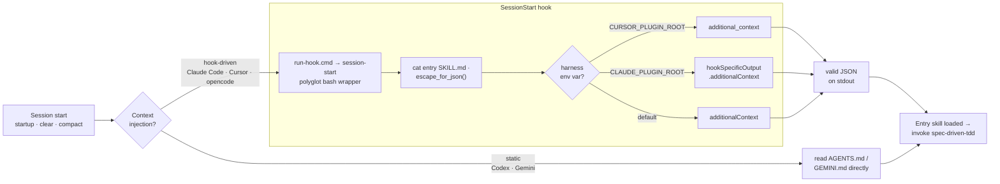
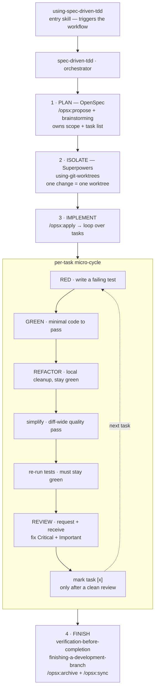

# spec-driven-tdd

An installable, multi-harness skill-pack that fuses **OpenSpec** (planning +
task tracking) with **Superpowers** (TDD, simplify, code review) into one
delivery loop.

Plan in OpenSpec → isolate in a worktree → implement each task via
TDD → simplify → review → finish and archive. A task is done only after a clean
review, not at green tests.

- Bundles every skill it needs as a first-class top-level skill: the portable
  `simplify` plus the vendored Superpowers set (see Credits).
- Works across Claude Code, Codex, Cursor, Gemini, and opencode.

## Install

[skills.sh](https://skills.sh) is the registry for the
[`skills`](https://github.com/vercel-labs/skills) CLI. One command installs every
bundled skill into your agent — the pack's own skills plus the vendored
Superpowers set — pulled straight from GitHub:

```bash
npx skills add strelov1/spec-driven-tdd
```

Once skills.sh indexes the repo it will also be browsable at its listing page;
until then, the command above is the canonical way in.

At runtime the workflow needs **OpenSpec** for the `/opsx:*` commands — install it
once with `npm i -g @fission-ai/openspec`. The
**[Superpowers](https://github.com/obra/superpowers)** skills are bundled, so they
need no separate install. What each provides is in
[docs/dependencies.md](docs/dependencies.md).

> Already have the Superpowers marketplace plugin? Skip the skills whose
> description is prefixed `[Superpowers …]` in the picker — they would duplicate
> the plugin's own skills.

## Workflow

See [docs/workflow.md](docs/workflow.md).

## How it works

### Context injection (install → SessionStart)

Hook-driven harnesses (Claude Code, Cursor, opencode) run the polyglot
`run-hook.cmd` wrapper, and the `session-start` script emits the entry skill as
harness-shaped JSON. Codex and Gemini have no hook mechanism — they read the
same entry context from a static `AGENTS.md` / `GEMINI.md`. Either way the agent
boots knowing the workflow exists.



### The lifecycle the skill enforces

The thin `using-spec-driven-tdd` entry skill triggers the `spec-driven-tdd`
orchestrator, which drives a four-phase loop. A task is `[x]` only after a clean
review — not at green tests.



OpenSpec is the only external prerequisite; the Superpowers skills and `simplify`
are bundled with the pack as top-level skills (see Credits).

## Test

```bash
npm test   # or: bash tests/run-all.sh
```

## Credits

Bundles [Superpowers](https://github.com/obra/superpowers) skills (MIT, © 2025
Jesse Vincent) as first-class top-level skills, each marked with a
`[Superpowers 5.1.0, MIT]` description prefix. See `skills/SUPERPOWERS-LICENSE`
and `skills/SUPERPOWERS-NOTICE.md`; refresh with `npm run vendor:superpowers`.

## License

MIT
